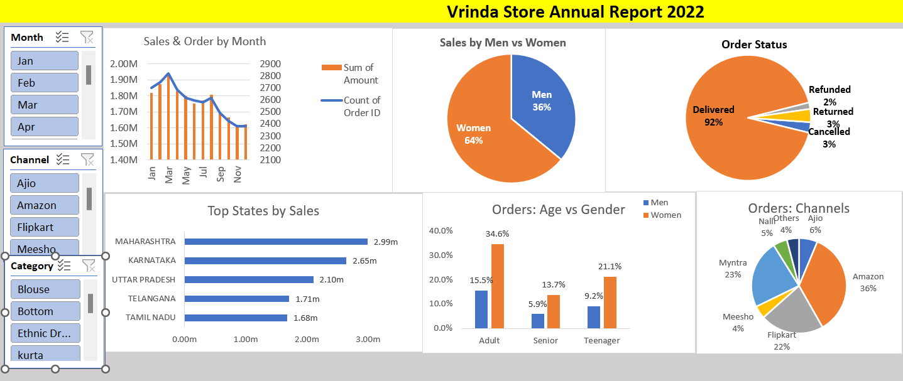

# Sales_Performance_Dashboard_Analysis

## 🔗 Quick Access
The dataset is embedded within the Excel file used for analysis
- 📥 [File](Excel_Project.xlsx)
- Additional sheets include pivot tables and dashboard visualizations
- 📊 [View Dashboard Image](Screenshotsdashboard.png)
> Note: Data has been cleaned and preprocessed before analysis.

## 🔍 Project Overview
This project analyses retail sales data to identify trends, customer behaviour, and revenue drivers to support business decision-making.

## ❓ Business Problem
The business lacks visibility into sales performance, customer behaviour, and key revenue drivers.

## Dashboard Preview

## 💡 Key Insights
- Women contribute ~64% of total purchases  
- Top states: Maharashtra, Karnataka, Uttar Pradesh  
- Adults (30–49) generate ~50% of orders  
- Amazon, Flipkart, Myntra drive majority of sales  

## 🚀 Recommendations
- Target women aged 30–49 with personalised campaigns  
- Focus marketing efforts in top-performing states  
- Increase engagement of male and teenage segments  
- Plan promotions during low-performing months

## 🎯 Business Impact This analysis enables businesses to: 
- Identify high-value customer segments 
- Optimise marketing strategies for top-performing regions 
- Improve revenue by targeting high-conversion demographics

## ⚙️ Approach
- Cleaned and standardised raw dataset  
- Created additional features (Age Group, Month) for analysis  
- Used pivot tables and charts to analyse sales trends and customer behaviour  
- Built an interactive dashboard using slicers for dynamic insights  

## 🛠 Tools Used
- Excel (Pivot Tables, Charts, Slicers)  
- Data Cleaning & Preprocessing  
- Data Visualization  
